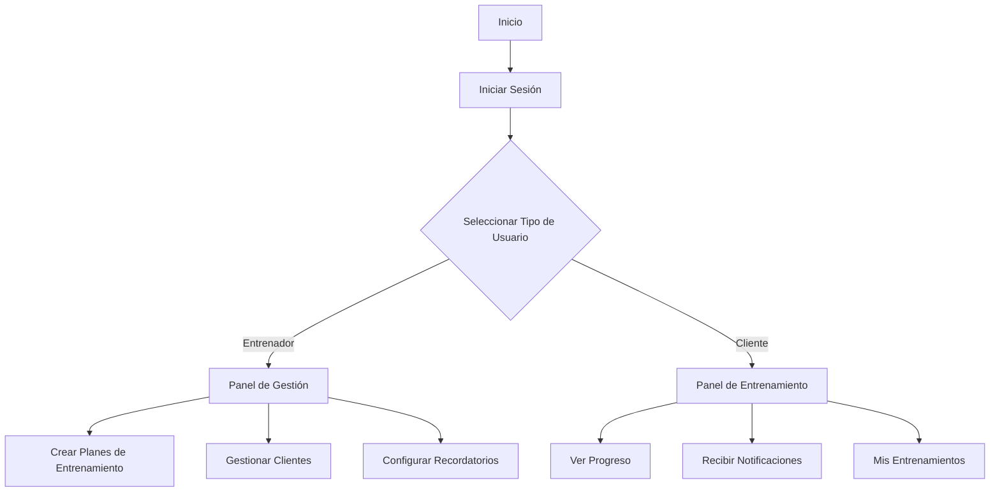
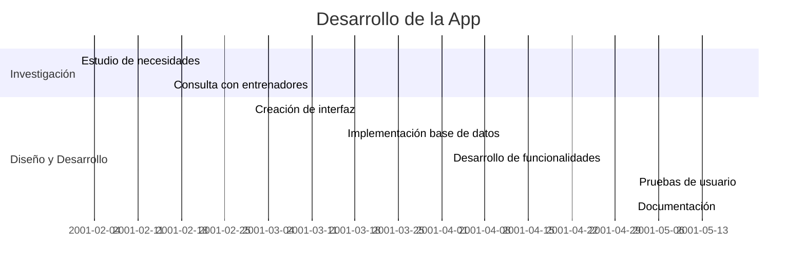
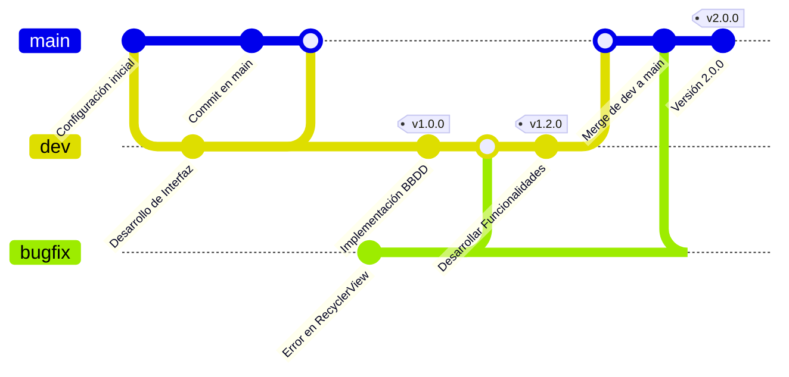
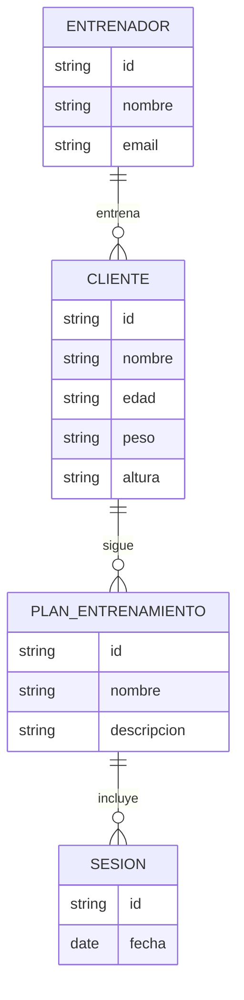
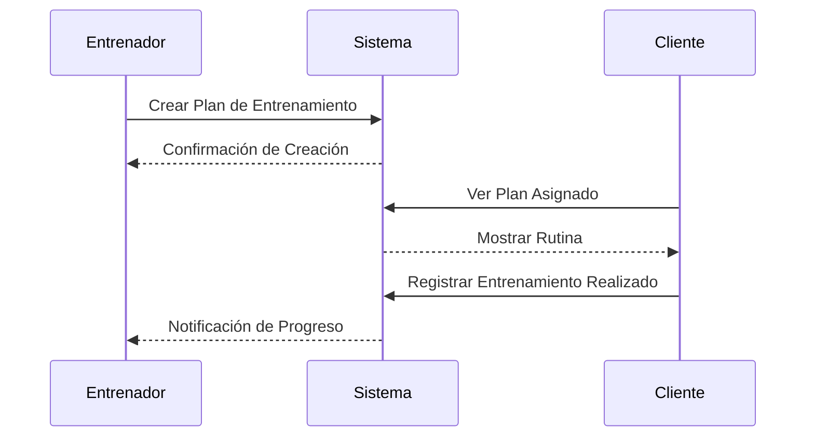
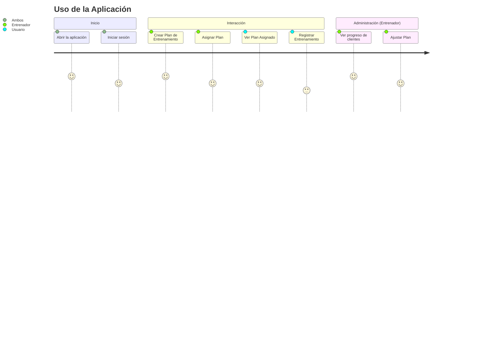

# 🏋️‍♂️ Aplicación para Entrenadores Personales

## 📌 Introducción

En este proyecto, hemos desarrollado una aplicación móvil diseñada para ayudar a los entrenadores personales a gestionar sus clientes de manera eficiente. La aplicación permite crear planes de entrenamiento personalizados, realizar un seguimiento detallado de las sesiones y enviar recordatorios automáticos, todo con el objetivo de facilitar la gestión de entrenamientos y mejorar el rendimiento de los clientes.

---

## 🎯 Objetivos

- 📊 **Gestionar el progreso de los clientes** de manera eficiente.
- 🏋️ **Crear y asignar planes de entrenamiento personalizados** según objetivos individuales.
- 🔔 **Implementar notificaciones y recordatorios automáticos** para sesiones de entrenamiento.
- 📅 **Ofrecer herramientas de seguimiento** para mejorar el rendimiento de los clientes.

---

## 📌 Características Principales

- ✅ Interfaz intuitiva y fácil de usar.
- ✅ Base de datos para almacenar información de clientes y entrenamientos.
- ✅ Sistema de notificaciones automáticas.
- ✅ Informes y estadísticas de progreso.
- ✅ Soporte para múltiples dispositivos.

---

## 📊 Tecnologías Utilizadas

| Tecnología | Uso |
|------------|-----|
|  | Entorno de desarrollo |
|  | Lenguaje de programación |
|  | Gestión de bases de datos |
|  | Diseño de interfaz |

---

## 🔄 Flujo de la Aplicación

## 📆 Planificación (Diagrama Gantt)

## 🐙 Planificación (Diagrama Git)

## 📜 Diagrama de Entidad-Relación

---

## 📜 Diagrama de Secuencia

## 📜 Diagrama de Requerimientos

```mermaid

requirementDiagram
    requirement R1 {
        id: 1
        text: "La aplicación debe permitir a los entrenadores crear planes de entrenamiento."
    }
    requirement R2 {
        id: 2
        text: "Los entrenadores deben poder asignar planes a los clientes."
    }
    requirement R3 {
        id: 3
        text: "Los clientes deben poder registrar sus entrenamientos."
    }
    requirement R4 {
        id: 4
        text: "El sistema debe enviar notificaciones automáticas."
    }
    requirement R5 {
        id: 5
        text: "Los entrenadores deben poder seguir el progreso de sus clientes."
    }

```

## 📜 Diagrama de Journey

#### 🧠 Importancia del seguimiento en el rendimiento deportivo
Los entrenadores deben contar con herramientas eficaces para monitorear el progreso de sus clientes. La capacidad de medir estadísticas físicas y mentales de estos a lo largo del tiempo permite optimizar las estrategias de entrenamiento, prevenir lesiones y ajustar la intensidad del entrenamiento según sea necesario.

---

## 📹 Video Demostrativo

#### Deporte 🏋️‍♂️ y salud mental 🧠

---

## 📩 Contacto

📧 Correo: [raniakacemi@gmail.com](mailto:raniakacemi@gmail.com)  
📌 GitHub: [github.com/Ranius7](https://github.com/Ranius7)  

---

🌟 ¡Espero que esta aplicación ayude a muchos entrenadores personales a mejorar su trabajo y a ofrecer un mejor servicio a sus clientes! 💪
